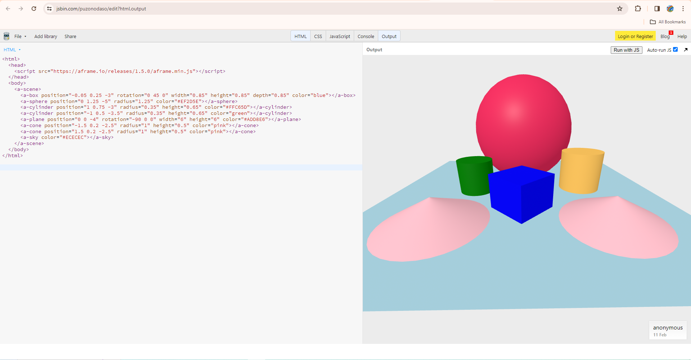

# Entry 4: Confirming Tool To Use For My Freedom Project
#### 2/12/2024

## Content: Choosing Tool And Tinkering With Tool

The tool I chose is called Aframe. I chose Aframe because Aframe is a web framework that makes a 3D virtual reality. It'll create a great virtual reality for my freedom project about music. I used [this website](https://aframe.io/docs/1.5.0/introduction/) to help me learn Aframe. I tinkered with Aframe using [jsbin.com](jsbin.com). I changed colors, added new 3D shapes and changed positions of the 3D shapes.

[Click This Link To See My Tinkering With Aframe](https://jsbin.com/puzonodaso/edit?html,output)



Code:
```html
<html>
  <head>
    <script src="https://aframe.io/releases/1.5.0/aframe.min.js"></script>
  </head>
  <body>
    <a-scene>
      <a-box position="-0.05 0.25 -3" rotation="0 45 0" width="0.85" height="0.85" depth="0.85" color="blue"></a-box>
      <a-sphere position="0 1.25 -5" radius="1.25" color="#EF2D5E"></a-sphere>
      <a-cylinder position="1 0.75 -3" radius="0.35" height="0.65" color="#FFC65D"></a-cylinder>
      <a-cylinder position="-1 0.5 -3.5" radius="0.35" height="0.65" color="green"></a-cylinder>
      <a-plane position="0 0 -4" rotation="-90 0 0" width="6" height="6" color="#ADD8E6"></a-plane>
      <a-cone position="-1.5 0.2 -2.5" radius="1" height="0.5" color="pink"></a-cone>
      <a-cone position="1.5 0.2 -2.5" radius="1" height="0.5" color="pink"></a-cone>
      <a-sky color="#ECECEC"></a-sky>
    </a-scene>
  </body>
</html>
```

## Sources

The sources I used to learn Aframe is [aframe.io](https://aframe.io).

I used [jsbin.com](jsbin.com) to tinker with Aframe.

## Engineering Design Process

Right now in the Engineering Design Process(EDP), I am on the 4th step(Plan the most promising solution). Our 4th step is to plan our solution. Currently, we are planning our tool to use for our freedom project. Our next step is to learn the tool we chose on our own(#loyo).

## Skills

1) How To Learn

The first skill I learned during this process is **how to learn**.

The skill how to learn is called #loyo, which means "Learn On Your Own." During this process, we have to learn a tool on our own for our freedom project. I used jsbin to tinker with Aframe to see if Aframe is right for me to learn.

2) Debugging

The second skill I learned during this process is **debugging**.

Tinkering means to play around/mess around with the code, see what happens if I changed part of the code. Tinkering is part of debugging. I tinkered in jsbin to see if Aframe is the right tool for me. I changed colors, added new 3D shapes and changed positions of the 3D shapes.

## Summary
In conclusion, I'm ready to learn Aframe to make a 3D virtual reality about my future musical technology on my Freedom Project website for my next step.

[Previous](entry03.md) | [Next](entry05.md)

[Home](../README.md)
