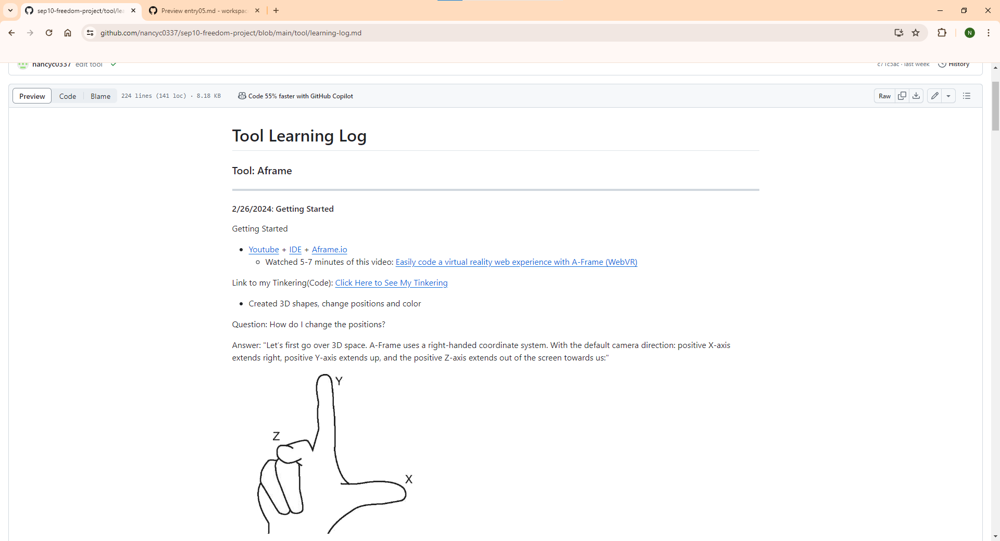

# Entry 5: Confirming Tool To Use For My Freedom Project
#### 4/8/2024

## Content: Learning About Aframe

The tool I chose is called Aframe. I chose Aframe because Aframe is a web framework that makes a 3D virtual reality. It'll create a great virtual reality for my freedom project about music. During this time, I used many resources to learn Aframe.

The sources I used to learn Aframe are:
1) [aframe.io](https://aframe.io)
2) [Easily code a virtual reality web experience with A-Frame (WebVR)](https://youtu.be/jhEfT9YjLcU?si=7MmcYtvEusZUHGti)
3) [Camera Primitive (A-Frame Tutorial - WebVR)](https://www.youtube.com/watch?v=kygiaSx6kbM)
4) [A-Frame Animation Tutorial](https://youtu.be/JDAdQV4YWRc?si=aFZdYRkCGUEhNHI5)
5) [A-Frame Tutorial: Creating a scene and adding text](https://youtu.be/cHWO-nWWe5w?si=8s110b6XY4_BMSWY)
6) [A-Frame Tutorial: Basic Lighting](https://youtu.be/9soV6wZsg40?si=KMCDEPRfEaX_oXwR)
7) [Aframe Webvr - VR Development Part 4 - Animation in Aframe](https://youtu.be/rl104MfKbW8?si=MZprs9ouGh6T6vSx)
8) [A-Frame WebVR Tutorial 9 - Model Loading](https://youtu.be/h9uAXlrPUzs?si=A4xvnrSdk5Bw_ud4)
9) [glTF models in A-Frame](https://youtu.be/eqiH5_CZDO0?si=0gLFHOUMF4oJicp6)
10) [Loading And Displaying 3D Models (A-Frame Tutorial - WebVR)](https://youtu.be/cS8uGfd_oG8?si=Ibz1Q2tSlkjvZSq7)
11) [Aframe Webvr - VR Development Part 13 - Sound Component](https://youtu.be/JBtBQQ_mKw4?si=6r7s9_eTkMchTcPk)
12) [Sound And Positional Audio (A-Frame Tutorial - WebVR)](https://youtu.be/fGmYp6-Sek8?si=sOJ05RjxFGx4zMOZ)
13) [A-Frame Examples](https://stemkoski.github.io/A-Frame-Examples/)

I learned many Aframe components like:
* basic lighting
* sound
* gltf-model
* camera
* scale
* background
* geometry, 3D-shapes
* rotation
* position
* animations
* `<a-text>`

I used my learning log to record the links I used, things I tried, challenges, questions and things I'm going to try next.

My Learning Log: (https://github.com/nancyc0337/sep10-freedom-project/blob/main/tool/learning-log.md)

## Sources

During this time, I used a lot of sources/websites to learn Aframe.

The sources I used to learn Aframe are:
1) Youtube.com
  * [Easily code a virtual reality web experience with A-Frame (WebVR)](https://youtu.be/jhEfT9YjLcU?si=7MmcYtvEusZUHGti)
  * [Camera Primitive (A-Frame Tutorial - WebVR)](https://www.youtube.com/watch?v=kygiaSx6kbM)
  * [A-Frame Animation Tutorial](https://youtu.be/JDAdQV4YWRc?si=aFZdYRkCGUEhNHI5)
  * [A-Frame Tutorial: Creating a scene and adding text](https://youtu.be/cHWO-nWWe5w?si=8s110b6XY4_BMSWY)
  * [A-Frame Tutorial: Basic Lighting](https://youtu.be/9soV6wZsg40?si=KMCDEPRfEaX_oXwR)
  * [Aframe Webvr - VR Development Part 4 - Animation in Aframe](https://youtu.be/rl104MfKbW8?si=MZprs9ouGh6T6vSx)
  * [A-Frame WebVR Tutorial 9 - Model Loading](https://youtu.be/h9uAXlrPUzs?si=A4xvnrSdk5Bw_ud4)
  * [glTF models in A-Frame](https://youtu.be/eqiH5_CZDO0?si=0gLFHOUMF4oJicp6)
  * [Loading And Displaying 3D Models (A-Frame Tutorial - WebVR)](https://youtu.be/cS8uGfd_oG8?si=Ibz1Q2tSlkjvZSq7)
  * [Aframe Webvr - VR Development Part 13 - Sound Component](https://youtu.be/JBtBQQ_mKw4?si=6r7s9_eTkMchTcPk)
  * [Sound And Positional Audio (A-Frame Tutorial - WebVR)](https://youtu.be/fGmYp6-Sek8?si=sOJ05RjxFGx4zMOZ)
2) [aframe.io](https://aframe.io)
  * basic lighting
    * [light](https://aframe.io/docs/1.5.0/components/light.html)
    * [a-light](https://aframe.io/docs/1.5.0/primitives/a-light.html)
  * sound
    * [sound](https://aframe.io/docs/1.5.0/components/sound.html)
    * [a-sound](https://aframe.io/docs/1.5.0/primitives/a-sound.html)
  * gltf-model
    * [gltf-model](https://aframe.io/docs/1.5.0/components/gltf-model.html)
    * [a-gltf-model](https://aframe.io/docs/1.5.0/primitives/a-gltf-model.html)
  * camera
    * [camera](https://aframe.io/docs/1.5.0/components/camera.html)
    * [a-camera](https://aframe.io/docs/1.5.0/primitives/a-camera.html)
  * scale
    * [scale](https://aframe.io/docs/1.5.0/components/scale.html)
  * background
    * [background](https://aframe.io/docs/1.5.0/components/background.html)
  * geometry, 3D-shapes
    * [geometry](https://aframe.io/docs/1.5.0/components/geometry.html)
      * [a-box](https://aframe.io/docs/1.5.0/primitives/a-box.html)
      * [a-circle](https://aframe.io/docs/1.5.0/primitives/a-circle.html)
      * [a-cone](https://aframe.io/docs/1.5.0/primitives/a-cone.html)
      * [a-cylinder](https://aframe.io/docs/1.5.0/primitives/a-cylinder.html)
      * [a-dodecahedron](https://aframe.io/docs/1.5.0/primitives/a-dodecahedron.html)
      * [a-icosahedron](https://aframe.io/docs/1.5.0/primitives/a-icosahedron.html)
      * [a-octahedron](https://aframe.io/docs/1.5.0/primitives/a-octahedron.html)
      * [a-plane](https://aframe.io/docs/1.5.0/primitives/a-plane.html)
      * [a-ring](https://aframe.io/docs/1.5.0/primitives/a-ring.html)
      * [a-sky](https://aframe.io/docs/1.5.0/primitives/a-sky.html)
      * [a-sphere](https://aframe.io/docs/1.5.0/primitives/a-sphere.html)
      * [a-tetrahedron](https://aframe.io/docs/1.5.0/primitives/a-tetrahedron.html)
      * [a-torus-knot](https://aframe.io/docs/1.5.0/primitives/a-torus-knot.html)
      * [a-torus](https://aframe.io/docs/1.5.0/primitives/a-torus.html)
      * [a-triangle](https://aframe.io/docs/1.5.0/primitives/a-triangle.html)
  * rotation
    * [rotation](https://aframe.io/docs/1.5.0/components/rotation.html)
  * position
    * [position](https://aframe.io/docs/1.5.0/components/position.html)
  * animations
    * [animation](https://aframe.io/docs/1.5.0/components/animation.html)
  * `<a-text>`
    * [text](https://aframe.io/docs/1.5.0/components/text.html)
    * [a-text](https://aframe.io/docs/1.5.0/primitives/a-text.html)
3) [cs50.dev-IDE](cs50.dev)
4) [A-Frame Examples](https://stemkoski.github.io/A-Frame-Examples/)

## Engineering Design Process

Right now in the Engineering Design Process(EDP), I am on the 4th step(Plan the most promising solution). Our 4th step is to plan our solution. During this time, I learned my tool(Aframe) on my own(#loyo) in my learning log. Currently, we are planning for our Wireframe and the MVP for our Freedom Project website. For our next step, we'll be making our Freedom Project website about our topic.

My Learning Log: (https://github.com/nancyc0337/sep10-freedom-project/blob/main/tool/learning-log.md)

My Content: (https://github.com/nancyc0337/sep10-freedom-project/blob/main/prep/content.md)

My Plan: (https://github.com/nancyc0337/sep10-freedom-project/blob/main/prep/plan.md)

## Skills

1) How To Learn

The first skill I learned during this process is **how to learn**.

The skill how to learn is called #loyo, which means "Learn On Your Own." During this process, we have to learn a tool on our own for our freedom project. I used many resources to learn aframe tinker with Aframe.

Resources:

* Youtube.com
  * [Easily code a virtual reality web experience with A-Frame (WebVR)](https://youtu.be/jhEfT9YjLcU?si=7MmcYtvEusZUHGti)
  * [Camera Primitive (A-Frame Tutorial - WebVR)](https://www.youtube.com/watch?v=kygiaSx6kbM)
  * [A-Frame Animation Tutorial](https://youtu.be/JDAdQV4YWRc?si=aFZdYRkCGUEhNHI5)
  * [A-Frame Tutorial: Creating a scene and adding text](https://youtu.be/cHWO-nWWe5w?si=8s110b6XY4_BMSWY)
  * [A-Frame Tutorial: Basic Lighting](https://youtu.be/9soV6wZsg40?si=KMCDEPRfEaX_oXwR)
  * [Aframe Webvr - VR Development Part 4 - Animation in Aframe](https://youtu.be/rl104MfKbW8?si=MZprs9ouGh6T6vSx)
  * [A-Frame WebVR Tutorial 9 - Model Loading](https://youtu.be/h9uAXlrPUzs?si=A4xvnrSdk5Bw_ud4)
  * [glTF models in A-Frame](https://youtu.be/eqiH5_CZDO0?si=0gLFHOUMF4oJicp6)
  * [Loading And Displaying 3D Models (A-Frame Tutorial - WebVR)](https://youtu.be/cS8uGfd_oG8?si=Ibz1Q2tSlkjvZSq7)
  * [Aframe Webvr - VR Development Part 13 - Sound Component](https://youtu.be/JBtBQQ_mKw4?si=6r7s9_eTkMchTcPk)
  * [Sound And Positional Audio (A-Frame Tutorial - WebVR)](https://youtu.be/fGmYp6-Sek8?si=sOJ05RjxFGx4zMOZ)
* [aframe.io](https://aframe.io)
  * basic lighting
    * [light](https://aframe.io/docs/1.5.0/components/light.html)
    * [a-light](https://aframe.io/docs/1.5.0/primitives/a-light.html)
  * sound
    * [sound](https://aframe.io/docs/1.5.0/components/sound.html)
    * [a-sound](https://aframe.io/docs/1.5.0/primitives/a-sound.html)
  * gltf-model
    * [gltf-model](https://aframe.io/docs/1.5.0/components/gltf-model.html)
    * [a-gltf-model](https://aframe.io/docs/1.5.0/primitives/a-gltf-model.html)
  * camera
    * [camera](https://aframe.io/docs/1.5.0/components/camera.html)
    * [a-camera](https://aframe.io/docs/1.5.0/primitives/a-camera.html)
  * scale
    * [scale](https://aframe.io/docs/1.5.0/components/scale.html)
  * background
    * [background](https://aframe.io/docs/1.5.0/components/background.html)
  * geometry, 3D-shapes
    * [geometry](https://aframe.io/docs/1.5.0/components/geometry.html)
      * [a-box](https://aframe.io/docs/1.5.0/primitives/a-box.html)
      * [a-circle](https://aframe.io/docs/1.5.0/primitives/a-circle.html)
      * [a-cone](https://aframe.io/docs/1.5.0/primitives/a-cone.html)
      * [a-cylinder](https://aframe.io/docs/1.5.0/primitives/a-cylinder.html)
      * [a-dodecahedron](https://aframe.io/docs/1.5.0/primitives/a-dodecahedron.html)
      * [a-icosahedron](https://aframe.io/docs/1.5.0/primitives/a-icosahedron.html)
      * [a-octahedron](https://aframe.io/docs/1.5.0/primitives/a-octahedron.html)
      * [a-plane](https://aframe.io/docs/1.5.0/primitives/a-plane.html)
      * [a-ring](https://aframe.io/docs/1.5.0/primitives/a-ring.html)
      * [a-sky](https://aframe.io/docs/1.5.0/primitives/a-sky.html)
      * [a-sphere](https://aframe.io/docs/1.5.0/primitives/a-sphere.html)
      * [a-tetrahedron](https://aframe.io/docs/1.5.0/primitives/a-tetrahedron.html)
      * [a-torus-knot](https://aframe.io/docs/1.5.0/primitives/a-torus-knot.html)
      * [a-torus](https://aframe.io/docs/1.5.0/primitives/a-torus.html)
      * [a-triangle](https://aframe.io/docs/1.5.0/primitives/a-triangle.html)
  * rotation
    * [rotation](https://aframe.io/docs/1.5.0/components/rotation.html)
  * position
    * [position](https://aframe.io/docs/1.5.0/components/position.html)
  * animations
    * [animation](https://aframe.io/docs/1.5.0/components/animation.html)
  * `<a-text>`
    * [text](https://aframe.io/docs/1.5.0/components/text.html)
    * [a-text](https://aframe.io/docs/1.5.0/primitives/a-text.html)
* [cs50.dev-IDE](cs50.dev)
* [A-Frame Examples](https://stemkoski.github.io/A-Frame-Examples/)

2) Problem decomposition

The second skill I learned during this process is **Problem decomposition**.

The skill problem decomposition is about breaking a task down into smaller pieces. During this time, I break my problem(learning Aframe) down into smaller pieces. Each week, I learned different Aframe components using many resources.

3) Debugging

The third skill I learned during this process is **Debugging**.

Tinkering means to play around/mess around with the code, see what happens if I changed that part of the code. Tinkering is part of debugging. I tinkered in my IDE(cs50.dev).

## Summary
In conclusion, I'm ready to use all my knowledge (HTML, CSS, Bootstrap, Bootstrap-Template, Wireframe, Aframe, etc) to make my Freedom Project website for my next step.

My Content: (https://github.com/nancyc0337/sep10-freedom-project/blob/main/prep/content.md)

My Plan: (https://github.com/nancyc0337/sep10-freedom-project/blob/main/prep/plan.md)

[Previous](entry04.md) | [Next](entry06.md)

[Home](../README.md)
