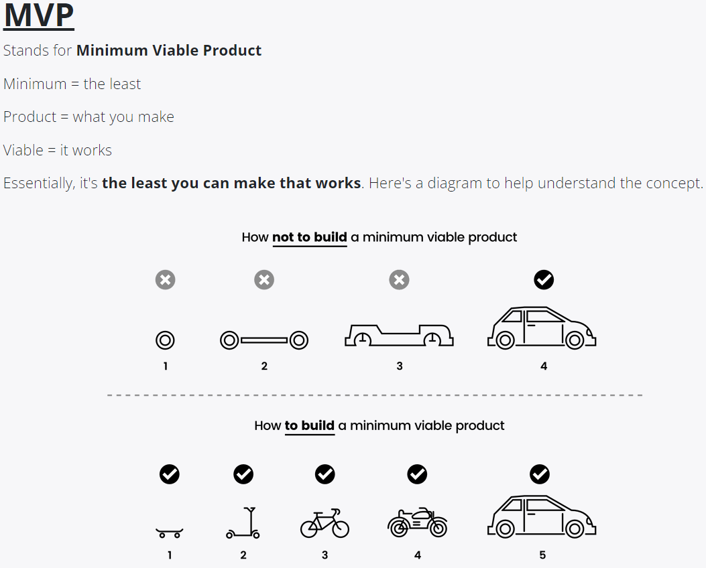
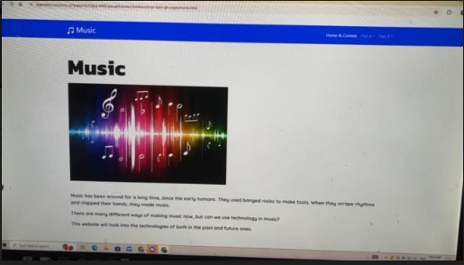
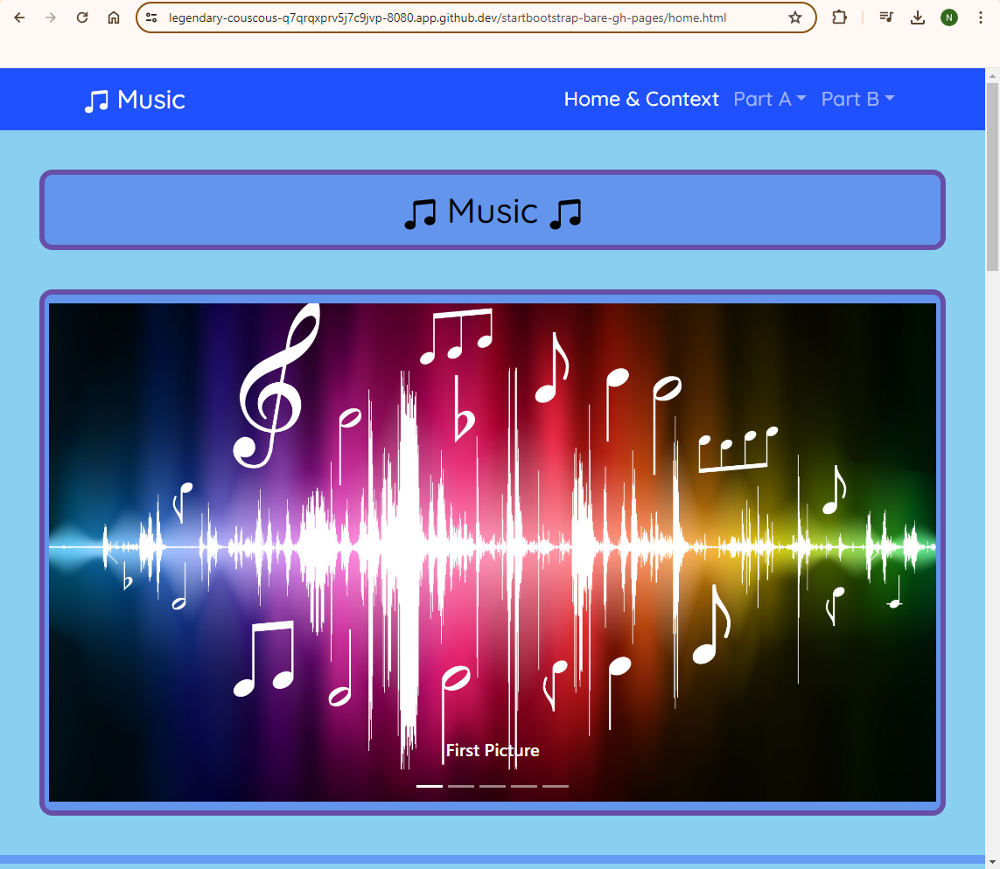

# Entry 6: MVP
#### 5/1/2024

## Content: MVP

I made my MVP(Minimum Visible Product) by first downloading the [bare starter template](https://startbootstrap.com/template/bare), then I made each tab/page for my webpage. I put each HTML, CSS, content & responsive in each tab/page.

One challenge I had is my css. I wanted my picture to be on the right and my text "Music" on the left. But the code I tried didn't work out so I decided to do it in a different way.

Beginning:

I put:
* rounded borders
* Cornflower Blue for the color
* text in the center
* more pictures added for the carousel

After:

The takeaway I got is even though I didn't get what I want originally, I can do things another way.

1. "There's many solutions to a problem."

2. "There's many ways of doing something."

## Sources

During this time, I used my IDE (cs50.dev) to put in my code for the [freedom project website](https://nancyc0337.github.io/sep10-freedom-project).

When I had trouble with my css, I used [CSS-W3Schools](https://www.w3schools.com/css/default.asp) to fix my bug in the code to get the response that I want.

1) [Responsive Text](https://www.w3schools.com/howto/howto_css_responsive_text.asp)
2) [Responsive Image](https://www.w3schools.com/howto/howto_css_image_responsive.asp)

When I wanted to add a bootstrap components, I used Bootstrap-Components to add bootstrap components that I need for my website.
1) [Navbar](https://getbootstrap.com/docs/5.2/components/navbar/)
2) [Accordion](https://getbootstrap.com/docs/5.2/components/accordion/)
3) [Carousel](https://getbootstrap.com/docs/5.2/components/carousel/)
4) [Buttons](https://getbootstrap.com/docs/5.2/components/buttons/)

## Engineering Design Process

Right now in the Engineering Design Process(EDP), I am on the 5th (Create a prototype), 6th (Test and evaluate the prototype) and 7th (Improve as needed) step. During this time, we created our Freedom Project website and we tested the prototype. Currently, we are improving our website to make it even better. We are going to edit any bugs, change any colors, etc.

Codes:

1) https://github.com/nancyc0337/sep10-freedom-project

2) https://github.com/nancyc0337/sep10-freedom-project/blob/main/index.html

3) https://github.com/nancyc0337/sep10-freedom-project/blob/main/software.html

4) https://github.com/nancyc0337/sep10-freedom-project/blob/main/hardware.html

5) https://github.com/nancyc0337/sep10-freedom-project/blob/main/ai-music-trainer.html

6) https://github.com/nancyc0337/sep10-freedom-project/blob/main/music-watch.html

[Link to My Freedom Project Website](https://nancyc0337.github.io/sep10-freedom-project)

## Skills

1) Attention to detail

The first skill I learned during this process is **Attention to detail**.

The skill Attention to detail is about spelling things correctly, adhering to syntax rules, etc. When I downloaded the [bare starter template](https://startbootstrap.com/template/bare), there's a lot of css codes in the styles.css file. So I used `command f` to search for the class/id. I used `inspect` for the output/product to see what the code does to the product.

2) Debugging

The second skill I learned during this process is **Debugging**.

The skill Debugging is about reading errors, tinkering, talking through the problem (RDD). When I make my website, I have to look for errors & tinker my codes.

3) Problem decomposition

The third skill I learned during this process is **Problem Decomposition**

The skill Problem Decomposition is about breaking a task down into smaller pieces. During this time, I break my problem(making the freedom project website) down into smaller pieces. I did each page of the website with each of the timeframe. I did the easy parts of the coding like copying the contents and replace them with HTML. I leave the hard parts like css & responsive till I'm finished with my HTML.

## Summary
In conclusion, I'm ready to keep editing my [Freedom Project website](https://nancyc0337.github.io/sep10-freedom-project) and getting ready to present my product to others.

[Previous](entry05.md) | [Next](entry07.md)

[Home](../README.md)
