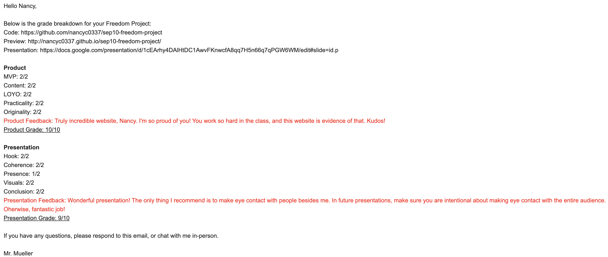

# Entry 7: Takeaways
##### 5/31/2024

## Content: Takeaways

### Expo Elevator Pitch
On May 24, my teacher (Mr. Mueller) taught my class about Elevator Pitch. Elevator Pitch is a short, persuasive speech that one gives in order to create interest in something. I made my elevator pitch using:
1) greeting
2) reason
3) Purpose
4) What I used for my project
5) Tool (Aframe)
6) Components of Bootstrap
7) Process (Challenges & Takeaways)
8) next steps
9) demo
10) questions

### In-class Presentations
During 5/21-5/23 and 5/29-5/31, my classmates and I presented our projects in front of the class. I presented on 5/23/2024.

My teacher (Mr. Mueller)'s comment:

Takeaways:

From giving my SEP Expo elevator pitch and my in-class presentation, I learned
the skill `communication` and `embracing failure/mistakes`. During my SEP Expo and my in-class presentation, I was nervous. But I feel good and proud after showing others what I have made.

## Sources

These are my sources (Picture of my elevator pitch & Link to my presentation):

My Elevator Pitch:

My Slides: [My Link to My Freedom Project Presentation](https://docs.google.com/presentation/d/1cEArhy4DAlHtDC1AwvFKnwcfA8qq7H5n66q7qPGW6WM/edit#slide=id.g2de46a2a3ca_0_113)

## Engineering Design Process

Right now in the Engineering Design Process(EDP), I am on the 8th (Communicate the results) step. We presented our SEP Freedom Projects to our classmates, teachers, judges, etc.

My Elevator Pitch:

My Slides: [My Link to My Freedom Project Presentation](https://docs.google.com/presentation/d/1cEArhy4DAlHtDC1AwvFKnwcfA8qq7H5n66q7qPGW6WM/edit#slide=id.g2de46a2a3ca_0_113)

## Skills

1) Communication

The first skill I learned during this process is **Communication**.

The skill Communication is about articulating ideas to your partner, writing in your portfolio, public speaking in presentations, etc. I presented my elevator pitch in the SEP Expo and my presentation in-class presentation(public speaking).

2) Embracing failure

The second skill I learned during this process is **Embracing failure**.

Embracing failure is about rather than being discouraged by a bug or an error message, we love mistakes because they help us learn. When my class finished the in-class presentations, my teacher (Mr. Mueller) sent an email to each of us, containing grades and feedback. When I saw my feedback, I was a little discouraged because I didn't make too much eye contact. But this feedback helped me to learn a mistake. Next time/step, I will take note and make eye contact with the entire audience.

## Summary
In conclusion, I'm proud of the amount of work I have put into my Freedom Project. I'm happy to learn SEP 10 with Mr. Mueller and my friends. I'd love to learn more SEP with Mr. Mueller.

[Previous](entry06.md)

[Home](../README.md)
