# Plan

## Wireframes
### Desktop
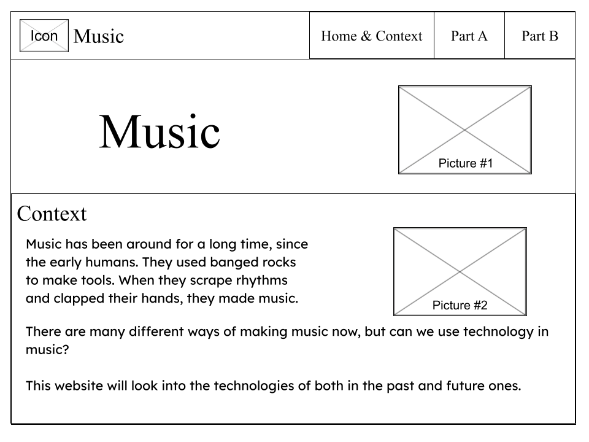
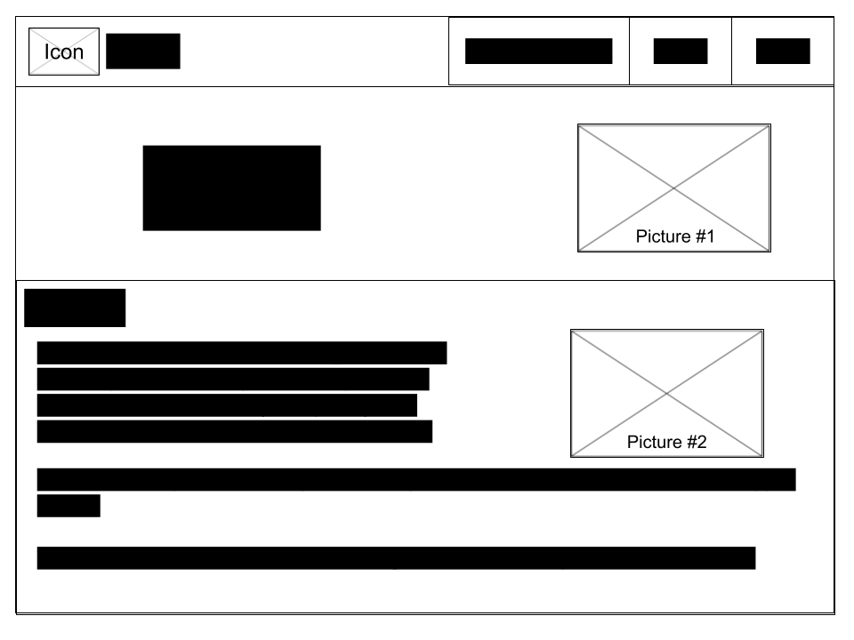
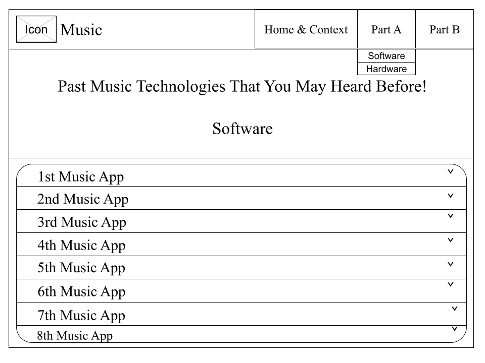
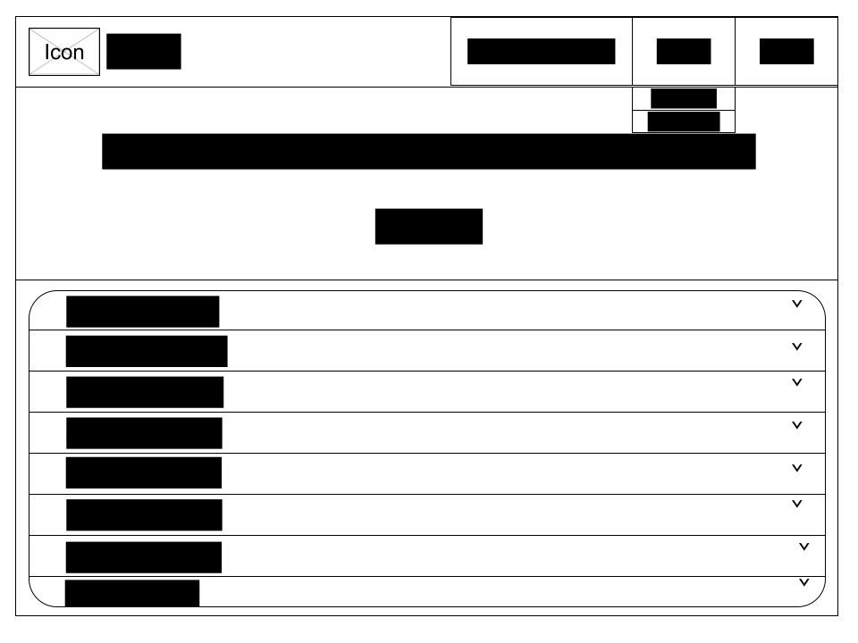
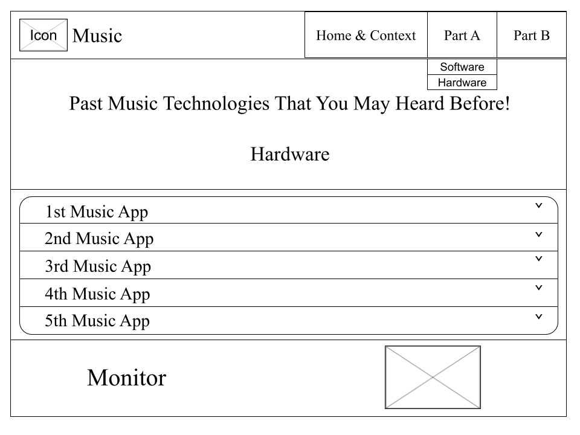
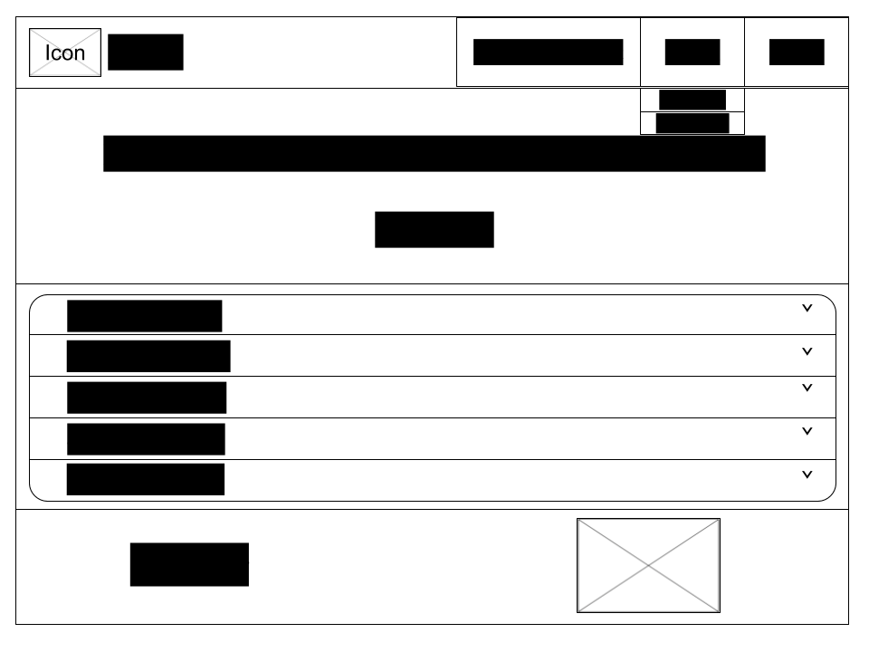
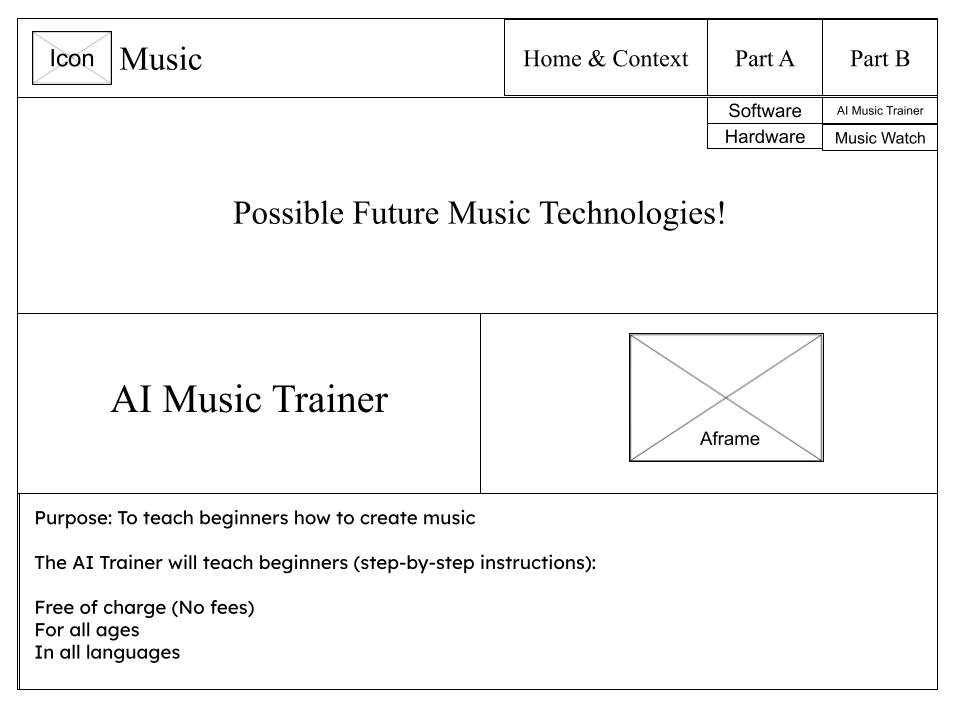
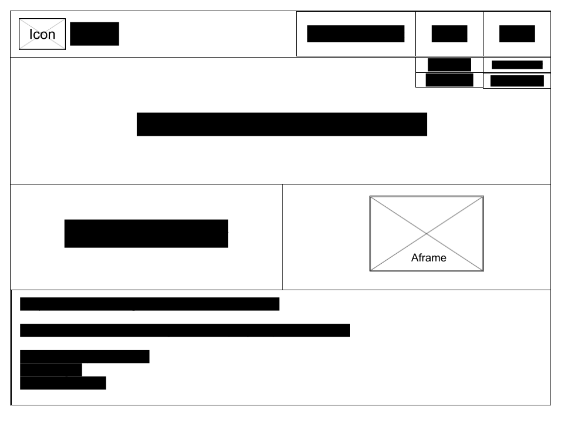

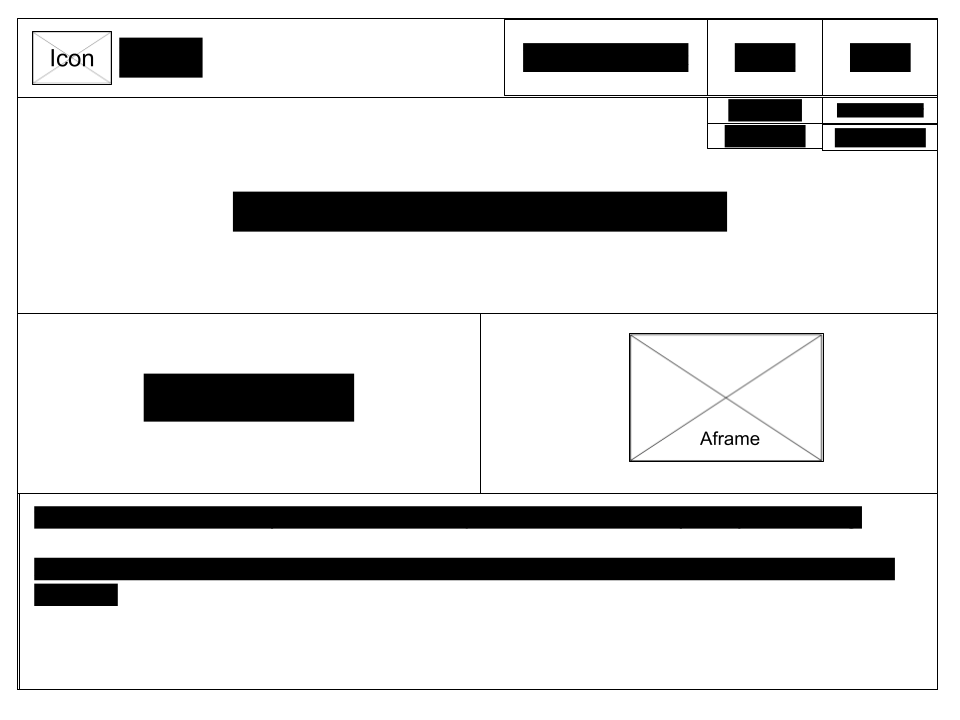

### Mobile
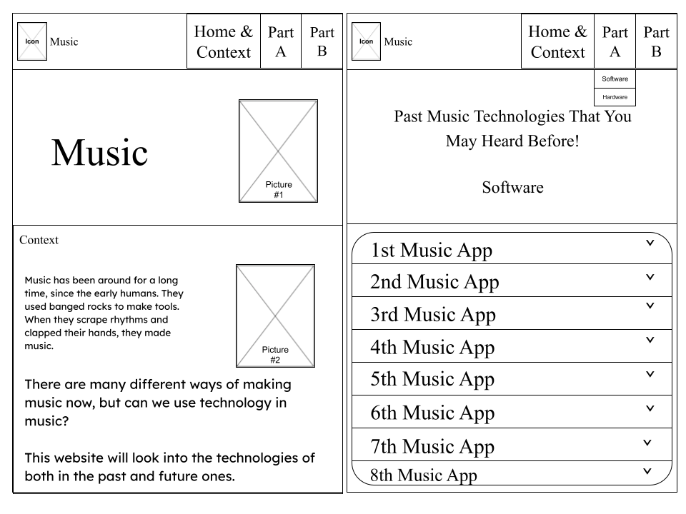

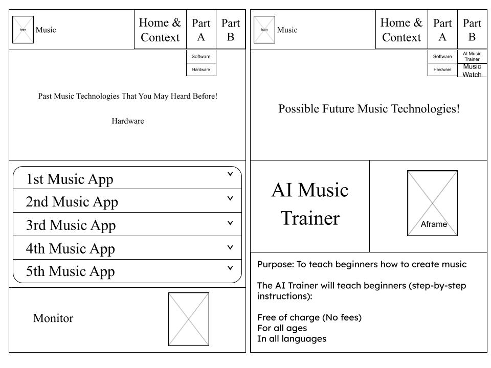

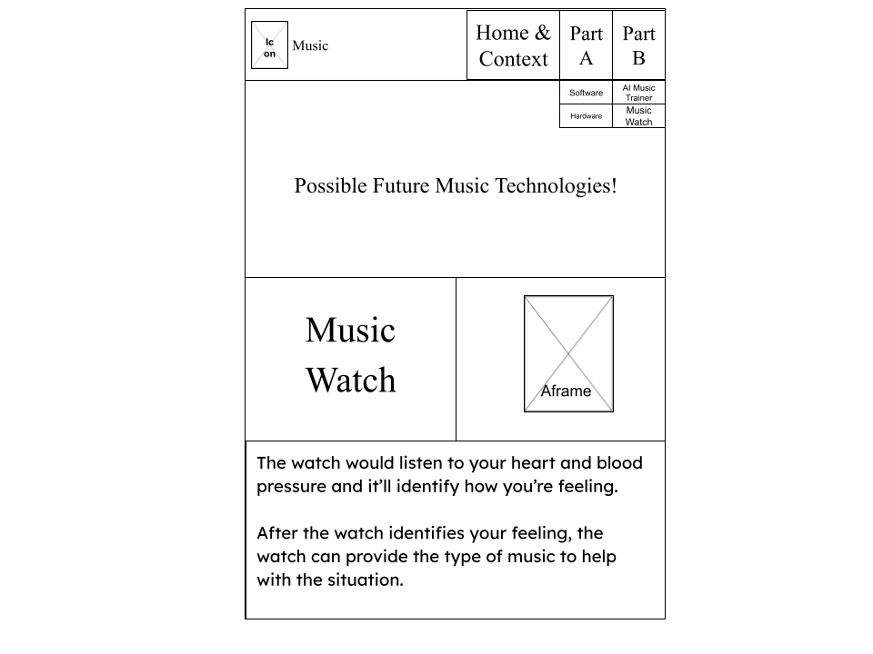
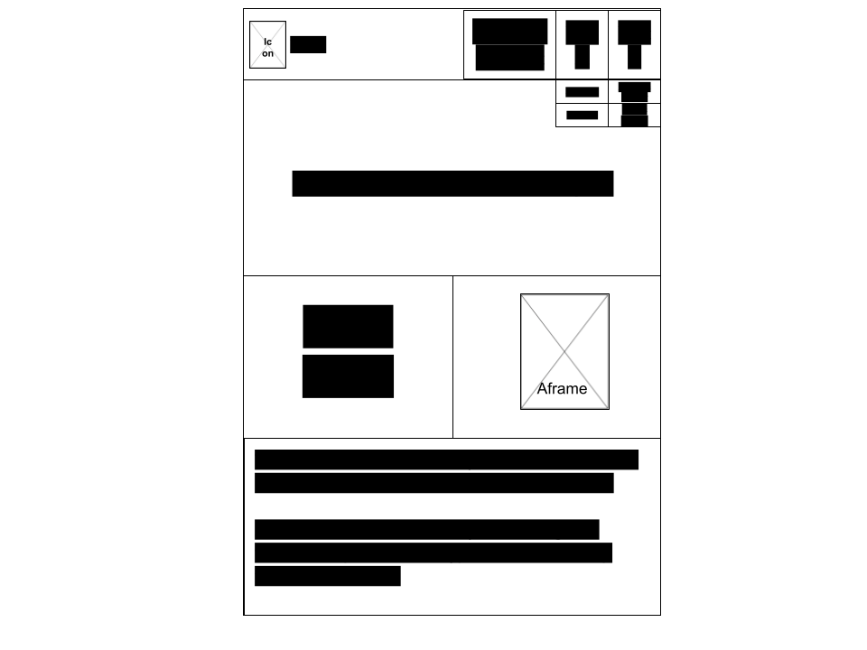

## Colors

[Shades of Blue](https://htmlcolorcodes.com/colors/shades-of-blue/)

* `#000000` --> black
* `#FFFFFF` --> white
* `#89CFF0` --> baby blue
* `#0000FF` --> blue
* `#0096FF` --> bright blue
* `#6495ED` --> cornflower blue
* `#ADD8E6` --> light blue
* `#A7C7E7` --> pastel blue
* `#87CEEB` --> sky blue
* `#0437F2` --> ultramarine

## Fonts
Link: (https://fonts.google.com/specimen/Quicksand?query=quicksand)
* Quicksand

## Icons
* [Icon: Music-Note-Beamed](https://icons.getbootstrap.com/icons/music-note-beamed/)
* [Icon: Down Arrow](https://icons.getbootstrap.com/icons/arrow-down/)

## Timeline

#### MVP

April 13-14:
* download basic template (https://startbootstrap.com/template/bare)
* edit navbar
  * css
  * html

April 15-17:
* enter all contents

April 18-20:
* edit css & responsive in `Home & Context` page

April 21-23:
* edit css & responsive in `Part A` page

April 22-26:
* use aframe in `Part A` & `Part B` page

April 24-27:
* edit css & responsive in `Part B` page

#### Beyond MVP
April 28-30:
* check for errors/edit any css

#### Feedback for Beyond MVP
Andre Pagan:
* There could be a little bit of a wider range of color and contrast, too much blending of the same color that it is kind of difficult to see.

Simran Sayeed:
* I think for the AI music trainer part, the last part could be a bulleted list instead of separate divs.

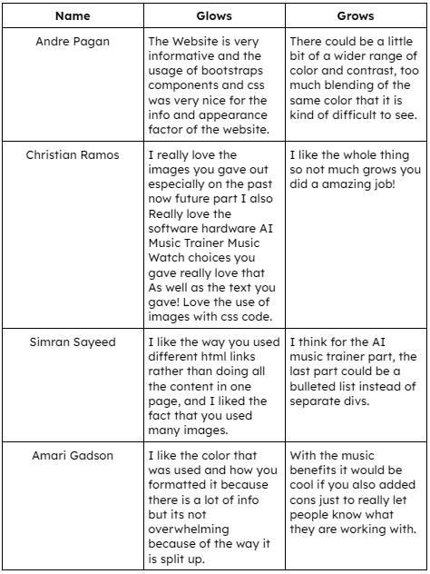

Most Important Change:
- [x] add more color

Second Important Change:
- [x] bulleted list for AI Music Trainer

