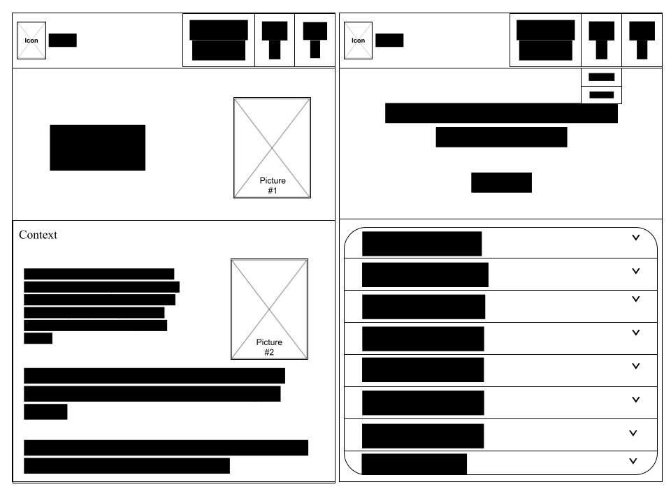
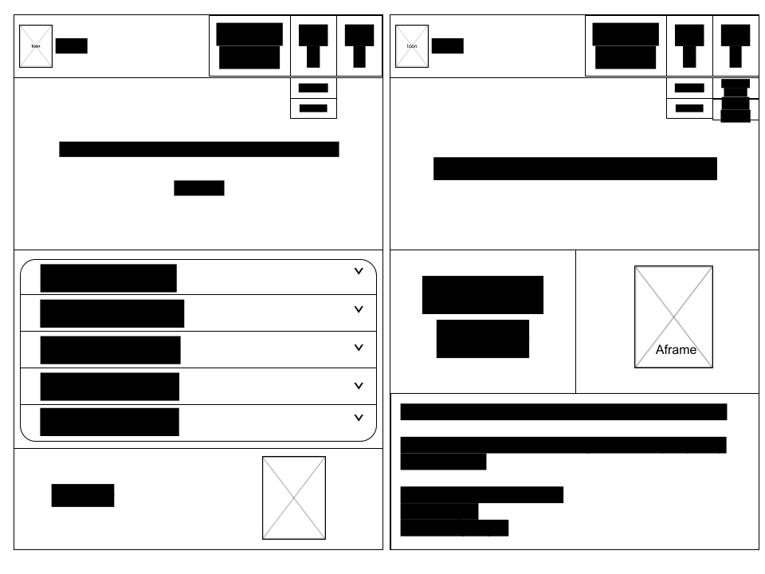

# Plan

## Wireframes
### Desktop

### Mobile

## Colors

* `#000000` --> black
* `#FFFFFF` --> white
* `#89CFF0` --> baby blue
* `#0000FF` --> blue
* `#0096FF` --> bright blue
* `#6495ED` --> cornflower blue
* `#ADD8E6` --> light blue
* `#A7C7E7` --> pastel blue
* `#87CEEB` --> sky blue
* `#0437F2` --> ultramarine 

## Fonts
* [Gasoek One-Heading](https://fonts.google.com/specimen/Gasoek+One?preview.text=I%27m%20the%20best!)
* [Montserrat-Paragraph](https://fonts.google.com/specimen/Montserrat?preview.text=I%27m%20the%20best!)

## Timeline

#### MVP

April 13-14:
* download basic template (https://startbootstrap.com/template/bare)
* edit navbar
  * css
  * html

April 15-17:
* enter all contents

April 18-20:
* edit css & responsive in `Home & Context` page

April 21-23:
* edit css & responsive in `Part A` page

April 22-26:
* use aframe in `Part A` & `Part B` page

April 24-27:
* edit css & responsive in `Part B` page

#### Beyond MVP
April 28-30:
* check for errors/edit any css
