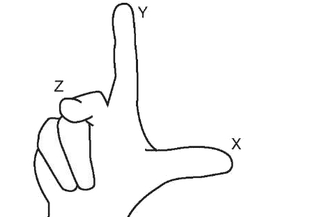
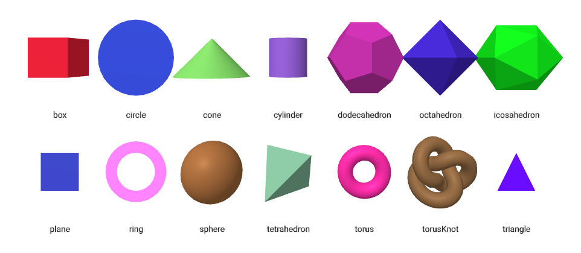

# Tool Learning Log

Tool: **Aframe**

---

2/26/2024:
* Getting Started
  * [Youtube](https://youtu.be/jhEfT9YjLcU?si=7MmcYtvEusZUHGti) + [IDE](cs50.dev) + [Aframe.io](aframe.io)
  * Watched 5-7 minutes of this video: [Easily code a virtual reality web experience with A-Frame (WebVR)](https://youtu.be/jhEfT9YjLcU?si=7MmcYtvEusZUHGti)

Link to my Tinkering(Code): [Click Here to See My Tinkering](https://github.com/nancyc0337/sep10-freedom-project/blob/main/tinkering-1/index.html)

* Created 3D shapes, change positions and color
  * How do I change the positions?

Answer: "Let’s first go over 3D space. A-Frame uses a right-handed coordinate system. With the default camera direction: positive X-axis extends right, positive Y-axis extends up, and the positive Z-axis extends out of the screen towards us:"



[Aframe.io](aframe.io) shows a section of primitives. There is a lot more 3D shapes that I can use.

Starter code:
```html
<html>
  <head>
    <script src="https://cdn.jsdelivr.net/gh/aframevr/aframe@9b8609bd84a292ef97bf1e8589401ae0d3201280/dist/aframe-master.min.js"></script>
  </head>
  <body>
    <a-scene>
      <!-- ... -->
    </a-scene>
  </body>
</html>
```
 * Next Steps:
   * Finish watch the [video](https://youtu.be/jhEfT9YjLcU?si=7MmcYtvEusZUHGti)
   * Tinkering with more 3D shapes and learn to use [background](https://aframe.io/docs/1.5.0/components/background.html#properties), [rotation](https://aframe.io/docs/1.5.0/components/rotation.html) and [scale](https://aframe.io/docs/1.5.0/components/scale.html), etc.

3/10/2024:
* Finishing the [video](https://youtu.be/jhEfT9YjLcU?si=7MmcYtvEusZUHGti)
* I tinkered in [cs50.dev](cs50.dev).

Link to my Tinkering(Code): [Click Here to See My Tinkering](https://github.com/nancyc0337/sep10-freedom-project/blob/main/tinkering-2/index.html)

* Next Steps:
  * Learn the component camera [(Link)](https://aframe.io/docs/1.5.0/components/camera.html)

3/17/2024:
* Learn the component camera
  * [Youtube](https://www.youtube.com/watch?v=kygiaSx6kbM) + [IDE](cs50.dev) + [Aframe.io](https://aframe.io/docs/1.5.0/components/camera.html#)

Link to my Tinkering(Code): [Click Here to See My Tinkering](https://github.com/nancyc0337/sep10-freedom-project/blob/main/tinkering-3/index.html)

How do I make the 3D objects sit at the ground level?

Answer: "When I change it the dimensions of the 3d objects, they extended their size along both the directions of each axis. Therefore to make them sit at the ground level, we need to move them up by changing the y axis value in the position component to half the value of their height that is 1 meter."

After this video, I learned that I can modify and control the a camera primitive in a-frame to design my custom scenes, bearing in mind how different heights and viewpoints will create different relationships between the 3d objects and the user and therefore impact their feelings and emotions in different ways.

* Next Steps:
  * Learn [background](https://aframe.io/docs/1.5.0/components/background.html#properties), [rotation](https://aframe.io/docs/1.5.0/components/rotation.html) and [scale](https://aframe.io/docs/1.5.0/components/scale.html)

3/18/2024 & 3/24/2024:

3/18/2024
* Use more 3D shapes
  * [IDE](cs50.dev) + [Aframe.io](https://aframe.io/docs/1.5.0/introduction/)

Link to my Tinkering(Code): [Click Here to See My Tinkering](https://github.com/nancyc0337/sep10-freedom-project/blob/main/tinkering-4/index.html)

Note:
* rotation="-90 0 0" --> makes the 3D shape horizontal
* "The background component sets a basic color background of a scene."

3D Shapes I can use in Aframe:


3/24/2024
* Used 3D shape: (`a-box`)
* Learned to use rotation, position and color animations
  * [IDE](cs50.dev) + [Aframe.io](https://aframe.io/docs/1.5.0/components/animation.html) + [Youtube](https://youtu.be/JDAdQV4YWRc?si=aFZdYRkCGUEhNHI5)

Link to my Tinkering(Code): [Click Here to See My Tinkering](https://github.com/nancyc0337/sep10-freedom-project/blob/main/tinkering-5/index.html)

* Next Steps:
  * Learn to [create a scene and add text](https://youtu.be/cHWO-nWWe5w?si=8s110b6XY4_BMSWY)

3/25/2024:
* Learn to [create a scene and add text](https://youtu.be/cHWO-nWWe5w?si=8s110b6XY4_BMSWY)
  * [Youtube](https://youtu.be/cHWO-nWWe5w?si=8s110b6XY4_BMSWY) + [IDE](cs50.dev) + [Aframe.io](https://aframe.io/docs/1.5.0/introduction/)

Link to my Tinkering(Code): [Click Here to See My Tinkering](https://github.com/nancyc0337/sep10-freedom-project/blob/main/tinkering-6/index.html)

How do I add text?

Answer: "a-text" variable can add text.

Notes:
* Make sure that the position and width is correct
* Make sure that the version of A-Frame is correct

X/X/X:
* Text

<!--
* Links you used today (websites, videos, etc)
* Things you tried, progress you made, etc
* Challenges, a-ha moments, etc
* Questions you still have
* What you're going to try next
-->
