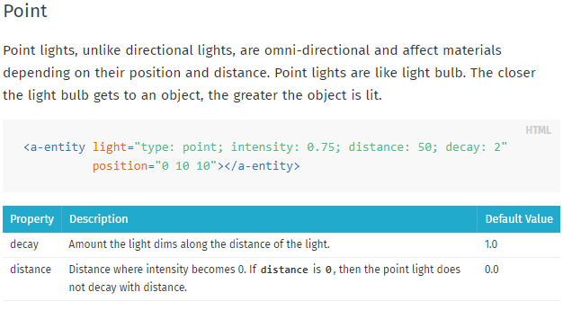

# Tool Learning Log

### Tool: **Aframe**

---

#### 2/26/2024: Getting Started

Getting Started
* [Youtube](https://youtu.be/jhEfT9YjLcU?si=7MmcYtvEusZUHGti) + [IDE](cs50.dev) + [Aframe.io](aframe.io)
  * Watched 5-7 minutes of this video: [Easily code a virtual reality web experience with A-Frame (WebVR)](https://youtu.be/jhEfT9YjLcU?si=7MmcYtvEusZUHGti)

Link to my Tinkering(Code): [Click Here to See My Tinkering](https://github.com/nancyc0337/sep10-freedom-project/blob/main/tinkering/tinkering-1/index.html)

* Created 3D shapes, change positions and color

Question: How do I change the positions?

Answer: "Let’s first go over 3D space. A-Frame uses a right-handed coordinate system. With the default camera direction: positive X-axis extends right, positive Y-axis extends up, and the positive Z-axis extends out of the screen towards us:"


[Aframe.io](aframe.io) shows a section of primitives. There is a lot more 3D shapes that I can use.

Starter code:
```html
<html>
  <head>
    <script src="https://cdn.jsdelivr.net/gh/aframevr/aframe@9b8609bd84a292ef97bf1e8589401ae0d3201280/dist/aframe-master.min.js"></script>
  </head>
  <body>
    <a-scene>
      <!-- ... -->
    </a-scene>
  </body>
</html>
```
Next Steps:
* Finish watch the [video](https://youtu.be/jhEfT9YjLcU?si=7MmcYtvEusZUHGti)
* Tinkering with more 3D shapes and learn to use [background](https://aframe.io/docs/1.5.0/components/background.html#properties), [rotation](https://aframe.io/docs/1.5.0/components/rotation.html) and [scale](https://aframe.io/docs/1.5.0/components/scale.html), etc.

#### 3/10/2024: Making A Virtual Reality Web Experience With A-Frame
* Finishing the [video](https://youtu.be/jhEfT9YjLcU?si=7MmcYtvEusZUHGti)
* I tinkered in [cs50.dev](cs50.dev).

Link to my Tinkering(Code): [Click Here to See My Tinkering](https://github.com/nancyc0337/sep10-freedom-project/blob/main/tinkering/tinkering-2/index.html)

Next Steps:
* Learn the component camera [(Click this Link)](https://aframe.io/docs/1.5.0/components/camera.html)

#### 3/17/2024: Learning About The Camera Component
* Learn the component camera
  * [Youtube](https://www.youtube.com/watch?v=kygiaSx6kbM) + [IDE](cs50.dev) + [Aframe.io](https://aframe.io/docs/1.5.0/components/camera.html#)

Link to my Tinkering(Code): [Click Here to See My Tinkering](https://github.com/nancyc0337/sep10-freedom-project/blob/main/tinkering/tinkering-3/index.html)

How do I make the 3D objects sit at the ground level?

Answer: "When I change it the dimensions of the 3d objects, they extended their size along both the directions of each axis. Therefore to make them sit at the ground level, we need to move them up by changing the y axis value in the position component to half the value of their height that is 1 meter."

After this video, I learned that I can modify and control the a camera primitive in a-frame to design my custom scenes, bearing in mind how different heights and viewpoints will create different relationships between the 3d objects and the user and therefore impact their feelings and emotions in different ways.

Next Steps:
* Learn [background](https://aframe.io/docs/1.5.0/components/background.html#properties), [rotation](https://aframe.io/docs/1.5.0/components/rotation.html) and [scale](https://aframe.io/docs/1.5.0/components/scale.html)

### 3/18/2024 & 3/24/2024: Learning About More 3D Shapes

#### 3/18/2024: Using More 3D Shapes
* Use more 3D shapes
  * [IDE](cs50.dev) + [Aframe.io](https://aframe.io/docs/1.5.0/introduction/)

Link to my Tinkering(Code): [Click Here to See My Tinkering](https://github.com/nancyc0337/sep10-freedom-project/blob/main/tinkering/tinkering-4/index.html)

Note:
* rotation="-90 0 0" --> makes the 3D shape horizontal
* "The background component sets a basic color background of a scene."

3D Shapes I can use in Aframe:


#### 3/24/2024: Using 3D Shape (Box) & Learned To Use Rotation, Position And Color Animations
* Used 3D shape: (`a-box`)
* Learned to use rotation, position and color animations
  * [IDE](cs50.dev) + [Aframe.io](https://aframe.io/docs/1.5.0/components/animation.html) + [Youtube](https://youtu.be/JDAdQV4YWRc?si=aFZdYRkCGUEhNHI5)

Link to my Tinkering(Code): [Click Here to See My Tinkering](https://github.com/nancyc0337/sep10-freedom-project/blob/main/tinkering/tinkering-5/index.html)

Next Steps:
* Learn to [create a scene and add text](https://youtu.be/cHWO-nWWe5w?si=8s110b6XY4_BMSWY)

#### 3/25/2024: Create A Scene And Adding Text
* Learn to [create a scene and add text](https://youtu.be/cHWO-nWWe5w?si=8s110b6XY4_BMSWY)
  * [Youtube](https://youtu.be/cHWO-nWWe5w?si=8s110b6XY4_BMSWY) + [IDE](cs50.dev) + [Aframe.io](https://aframe.io/docs/1.5.0/introduction/)

Link to my Tinkering(Code): [Click Here to See My Tinkering](https://github.com/nancyc0337/sep10-freedom-project/blob/main/tinkering/tinkering-6/index.html)

How do I add text?

Answer: `a-text` variable can add text.

Notes:
* Make sure that the position and width is correct
* Make sure that the version of A-Frame is correct

Next Steps:
* Learn [Basic Lighting](https://youtu.be/9soV6wZsg40?si=cO1au5Jbrs0wbBTY)
* [Youtube](https://youtu.be/9soV6wZsg40?si=cO1au5Jbrs0wbBTY) + [IDE](cs50.dev) + [Aframe.io-1](https://aframe.io/docs/0.5.0/components/light.html#sidebar) + [Aframe.io-2](https://aframe.io/docs/0.5.0/primitives/a-light.html#sidebar) + [Colorcodes.com](https://htmlcolorcodes.com/)

## Plan
### 4/3/2024: Plan--> Final Stretch [Timeline]

Question: How do you plan to use today and the next 2 days to finish learning your tool?

#### 4/3/2024 Wednesday: Basic Lighting & Animation

I can use these resources to learn basic lighting:

1. (https://youtu.be/9soV6wZsg40?si=KMCDEPRfEaX_oXwR)

2. (https://aframe.io/docs/0.5.0/components/light.html)

3. (https://aframe.io/docs/0.5.0/primitives/a-light.html)

I can use these resources to learn animation:

4. (https://youtu.be/rl104MfKbW8?si=MZprs9ouGh6T6vSx)

5. (https://aframe.io/docs/0.5.0/core/animations.html)

#### 4/4/2024 Thursday: Learning gltf-model & Sound

I can use these resources to learn gltf-model:

  1. (https://youtu.be/h9uAXlrPUzs?si=A4xvnrSdk5Bw_ud4)

  2. (https://youtu.be/eqiH5_CZDO0?si=0gLFHOUMF4oJicp6)

  3. (https://youtu.be/cS8uGfd_oG8?si=Ibz1Q2tSlkjvZSq7)

  4. (https://aframe.io/docs/0.5.0/components/gltf-model.html)

  5. (https://aframe.io/docs/0.5.0/primitives/a-gltf-model.html)

I can use these resources to learn sound:

  1. (https://youtu.be/JBtBQQ_mKw4?si=6r7s9_eTkMchTcPk)

  2. (https://youtu.be/fGmYp6-Sek8?si=sOJ05RjxFGx4zMOZ)

  3. (https://aframe.io/docs/0.5.0/components/sound.html)

  4. (https://aframe.io/docs/0.5.0/primitives/a-sound.html)

#### 4/5/2024 Friday: Tinker with What I Learned

Taking what I learned --> Making a tinker/experiment of:

* 3D Model of my Music Technology/Basic Scene of Music
* A scene using A-frame components that I learned
Use this website as a example: (https://stemkoski.github.io/A-Frame-Examples/)

A-Frame components that I learned:

* basic lighting
* sound
* gltf-model
* camera
* scale
* background
* geometry, 3D-shapes
* rotation
* position
* animations
* `<a-text>`

#### 4/3/2024: Basic Lighting & Animation

##### Basic Lighting:

My Tinkering:

* 1st Link to my Tinkering(Code): [Click Here to See My Tinkering #1](https://github.com/nancyc0337/sep10-freedom-project/blob/main/tinkering/tinkering-7/index.html)

* 2nd Link to my Tinkering(Code): [Click Here to See My Tinkering #2](https://github.com/nancyc0337/sep10-freedom-project/blob/main/tinkering/tinkering-8/index.html)

What I Learned (From [Aframe.io - Lights](https://aframe.io/docs/1.5.0/components/light.html)):

* "The light component defines the entity as a source of light."





##### Animation:

Link to my Tinkering(Code): [Click Here to See My Tinkering](https://github.com/nancyc0337/sep10-freedom-project/blob/main/tinkering-9/index.html)

Code:
* Reload the link --> the color of the floor will change each time
* the light on the boxes will change


#### 4/4/2024:


#### 4/5/2024:

<!--
* Links you used today (websites, videos, etc)
* Things you tried, progress you made, etc
* Challenges, a-ha moments, etc
* Questions you still have
* What you're going to try next
-->
